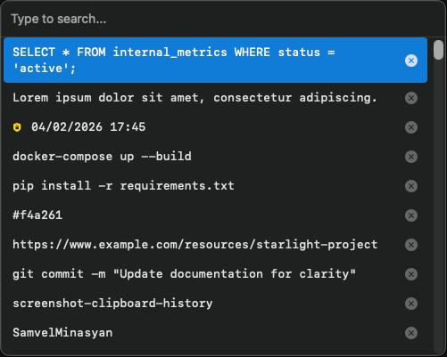
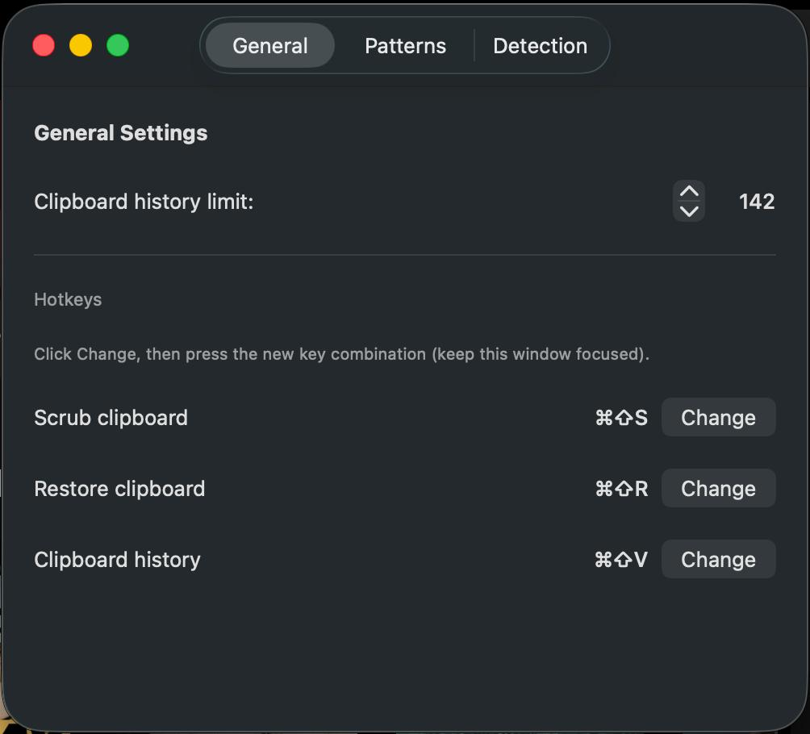
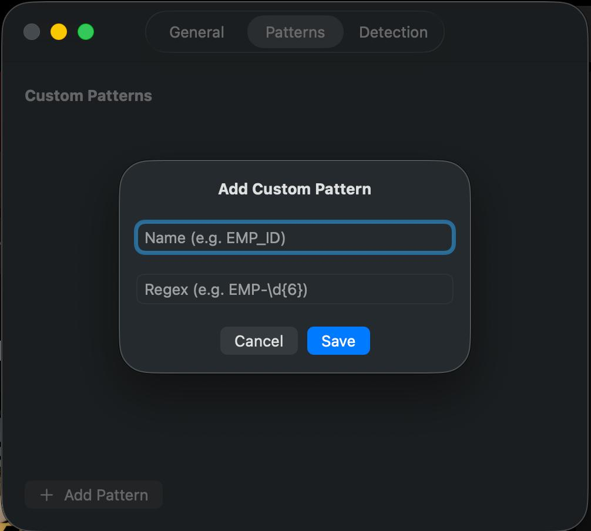
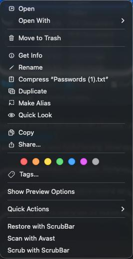

# ScrubBar — Free macOS clipboard history & PII scrubber

**Open-source menu bar app for macOS:** searchable **clipboard history**, hotkeys, and one-click **scrubbing** of sensitive data from the clipboard and files before you paste or share.

[](LICENSE)


<p align="center">
  
</p>

**ScrubBar** is a **free**, **open-source** Swift app for **macOS** that keeps a **local clipboard history** (no cloud), detects PII (emails, IPs, API keys, credit cards, SSNs, and 30+ other patterns), and replaces matches with numbered placeholders like `<EMAIL_1>`, `<APIKEY_1>`. Everything runs on your Mac — nothing is uploaded or sent over the network.

## Features

- **Free macOS clipboard history** — searchable, local-only history with keyboard navigation and quick paste (open-source; no subscription)
- **Scrub clipboard** — detect and replace sensitive values with placeholders
- **Restore clipboard** — convert placeholders back to originals (session-cached)
- **Scrub files from Finder** — right-click a file → Services → Scrub with ScrubBar
- **Restore scrubbed files** — right-click an obfuscated file → Services → Restore with ScrubBar
- **35+ detection patterns** — emails, IPs, credit cards, SSNs, AWS keys, JWTs, private keys, and more
- **Custom regex patterns** — add your own detection rules in Preferences
- **Deduplication** — the same value always maps to the same placeholder
- **Global hotkeys** — fully configurable keyboard shortcuts
- **Zero dependencies** — pure Swift, no third-party packages

## Installation

### 1. Requirements

- **macOS** 13.0 (Ventura) or later
- **Swift toolchain** — full **Xcode** from the Mac App Store, or **Xcode Command Line Tools**:
  ```bash
  xcode-select --install
  ```

### 2. Get the code

Clone this repository and enter the Swift package directory (where `Package.swift` and `setup.sh` live):

```bash
git clone https://github.com/SamvelMinasyan/ScrubBar.git
cd ScrubBar/ScrubBar
```

The Swift package and `setup.sh` live in the **`ScrubBar`** folder at the repository root. Example: if you cloned into `Ipaste`, run `cd Ipaste/ScrubBar`.

### 3. Run the setup script

From the `ScrubBar` directory:

```bash
chmod +x setup.sh   # only if your shell says “Permission denied”
./setup.sh
```

What `setup.sh` does:

1. **Builds** the release app (`swift build -c release` via `build_app.sh`).
2. **Installs** `ScrubBar.app` to `/Applications` (replaces any existing copy there).
3. **Asks you** to grant **Accessibility** access (needed for global hotkeys).
4. **Launches** `/Applications/ScrubBar.app`.

Follow the on-screen prompt: open **System Settings → Privacy & Security → Accessibility**, remove any stale “ScrubBar” entries, add **`/Applications/ScrubBar.app`**, then press Enter in the terminal to continue.

### 4. First launch (Gatekeeper)

The default build is **ad-hoc signed**. If macOS blocks the app the first time:

1. In **Finder**, open **Applications**, **Control-click** `ScrubBar.app` → **Open** → confirm **Open**, **or**
2. Run: `xattr -cr /Applications/ScrubBar.app` then open the app again.

For distribution without this step, sign with a **Developer ID** and **notarize** the app (see [Distribution](#distribution)).

### 5. Optional: build without installing

From the same `ScrubBar` directory (where `Package.swift` is):

```bash
swift build -c release
```

Binaries land under `.build/release/`. To produce `ScrubBar.app` in this folder **without** copying to `/Applications`, run `./build_app.sh` instead of `./setup.sh`.

## Default Hotkeys

| Shortcut | Action |
|----------|--------|
| `Cmd+Shift+S` | Scrub clipboard |
| `Cmd+Shift+R` | Restore clipboard |
| `Cmd+Shift+V` | Clipboard history |
| `Cmd+,` | Preferences |

All hotkeys are configurable in Preferences.

## Screenshots

| Clipboard history (main) | Menu bar | Scrub result |
|---------------------------|----------|--------------|
|  |  |  |

| File right-click | History search |
|-----------------|----------------|
|  |  |

## How It Works

### Clipboard Scrubbing

1. Copy text containing sensitive data.
2. Press `Cmd+Shift+S` (or click Scrub Clipboard in the menu).
3. ScrubBar detects PII and replaces values with numbered placeholders: `test@example.com` → `<EMAIL_1>`.
4. The same value always gets the same placeholder (deduplication).
5. Press `Cmd+Shift+R` to restore the original values.

### File Scrubbing

When you scrub a file via Finder Services:

- `MyFile.txt` → `MyFile_obfuscated.txt` (scrubbed copy, safe to share)
- A mapping file is stored at `~/Library/Application Support/ScrubBar/mappings/`

When you restore:

- `MyFile_obfuscated.txt` → `MyFile_restored.txt`
- The mapping file is deleted after a successful restore.

### CLI Tool

ScrubBar includes a command-line tool for batch file scrubbing:

```bash
cd ScrubBar
swift run ScrubBarCLI path/to/file.txt path/to/another.log
```

## Architecture

ScrubBar is a Swift Package with four targets:

| Target | Purpose |
|--------|---------|
| **ScrubBarCore** | Shared library — PII detection, state management, file operations |
| **ScrubBar** | macOS menu bar app (SwiftUI + AppKit) |
| **ScrubBarCLI** | Command-line file scrubber |
| **ScrubBarVerifier** | Verification utility for testing detection patterns |

```
ScrubBar/
├── Sources/
│   ├── ScrubBar/          # Menu bar app
│   ├── ScrubBarCore/      # Core library
│   │   ├── Model/         # PIIDetector, AppState, ClipboardMonitor, FileScrubber, FileRestorer
│   │   ├── View/          # HistoryView, SettingsView
│   │   └── Utils/         # Hotkeys, HotkeyRecorder, Logging
│   ├── ScrubBarCLI/       # CLI tool
│   └── ScrubBarVerifier/  # Verification tool
├── Tests/
│   └── ScrubBarTests/
├── Screenshots/
└── Package.swift
```

## Configuration

### Preferences

Open Preferences from the menu bar (`Cmd+,`):

- **General** — clipboard history limit (2–1000, default 250), hotkey configuration
- **Patterns** — add custom regex patterns (e.g., `EMP-\d{6}` for employee IDs)
- **Detection** — enable/disable individual detection types

### Clipboard History

- **Mouse wheel scroll** to navigate
- **Up/Down arrows** to move selection
- **Enter/Return** to paste the selected item
- **Type to search** — filters history in real time
- Click **x** to delete an item

## Distribution

### Building a Release

```bash
cd ScrubBar
./distribute.sh   # Creates ScrubBar-macOS.zip
```

### Gatekeeper Note

The default build uses **ad-hoc signing**. Recipients must:

1. **Right-click** `ScrubBar.app` → **Open** → **Open** (first launch only)
2. Or run: `xattr -cr /Applications/ScrubBar.app`

For a smooth install experience without this step, sign with a Developer ID and notarize the app.

## Privacy

ScrubBar does **not** send clipboard or file contents anywhere. All detection and replacement happens locally on your Mac. There is no telemetry, no network requests, and no analytics.

## Contributing

See [CONTRIBUTING.md](CONTRIBUTING.md) for guidelines on reporting bugs, submitting PRs, and adding detection patterns.

## License

[MIT](LICENSE) — Samvel Minasyan
